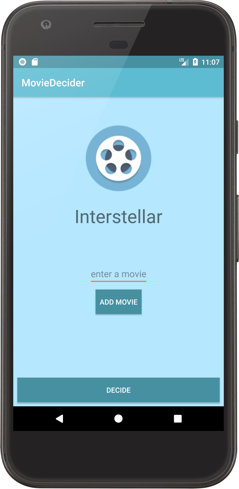
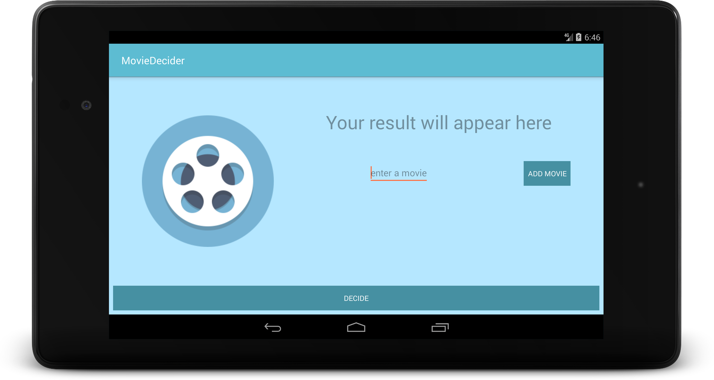

# Movie Decider

## Overview
Movie Decider helps users choosing a movie when they don't know what to watch. The user only needs to enter candicate movies titles, 
and then by pressing the Decide button, they app will randomly select one movie. This is my first app written in Kotlin.

## Features
- Support for different screen dimensions: portrait, landscape mode, and tablet

## Screenshots

